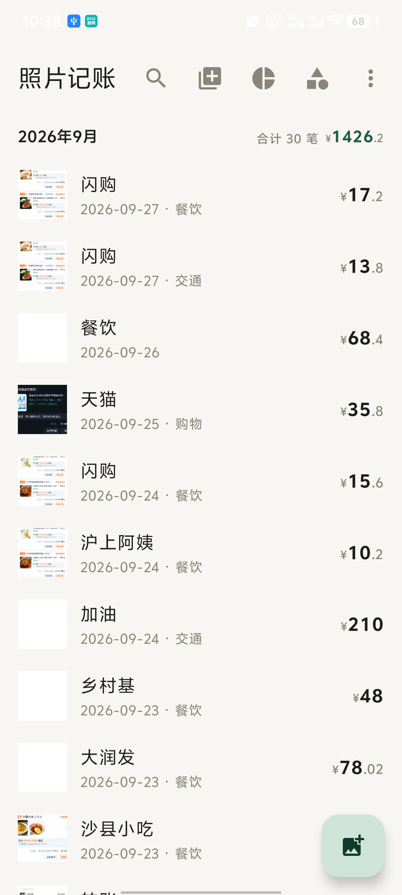
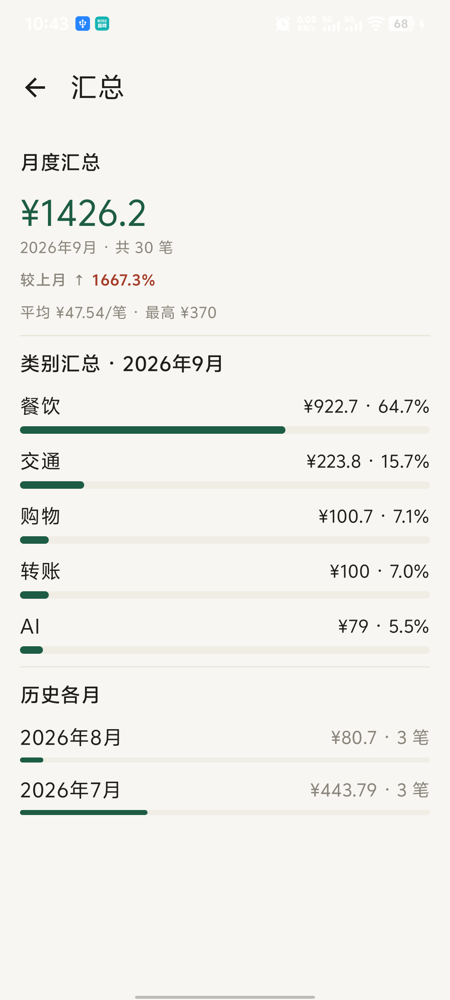
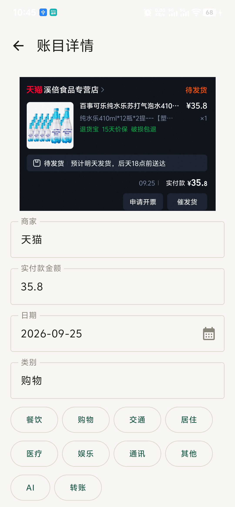
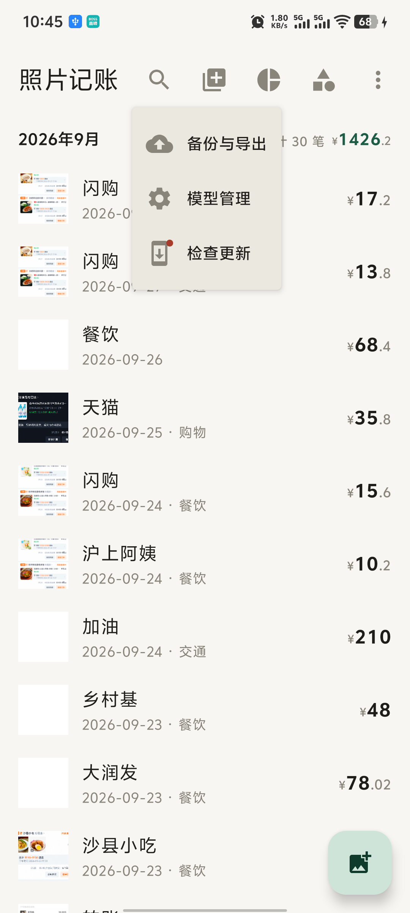
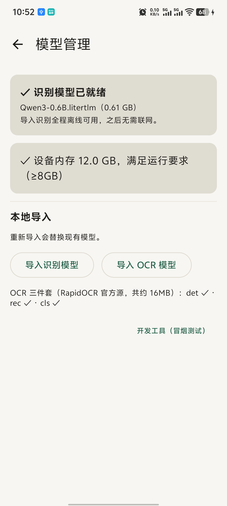
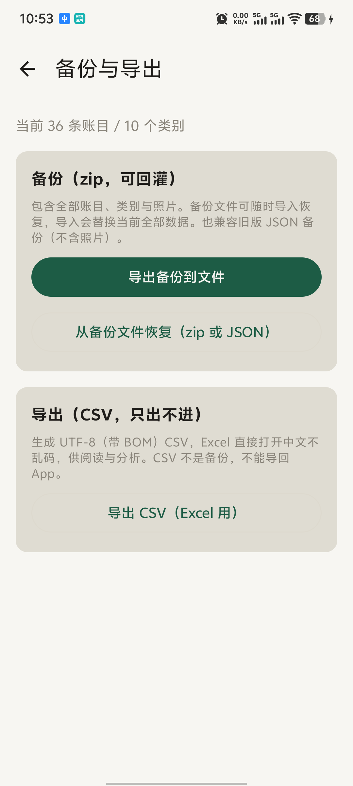

# Photo Ledger 照片记账

把支付截图变成账目——**全程端侧、离线、零上传**的 Android 记账应用。

从相册多选或系统分享支付宝 / 微信等支付的账单截图（支付成功页、账单详情页、订单页），应用在手机本地完成 OCR 识别与大模型字段提取，生成待确认的账目草稿，一键入账。

## 定位

手动录入的「摩擦力」是用户放弃记账的常见原因；截图自动识别记账已被头部竞品验证为真实需求——钱迹曾以隐私为由公开拒绝该功能，后被持续的用户反馈推动开发，2025 年底起陆续上线。同类产品的自动记账多走两条路：无障碍服务实时监听屏幕（隐私激进），或云 OCR 上传截图。本应用走第三条路：**识别全链路在端侧完成**——不监听屏幕、不授权银行或支付账号、截图与账目不出设备。

需求验证与竞品调研见 [docs/research/photo-ledger-demand.md](docs/research/photo-ledger-demand.md)（20 条来源）；端侧小模型应用生态参照见 [docs/research/on-device-small-models-apps.md](docs/research/on-device-small-models-apps.md)。

## 界面预览

真机截图（vivo V2183A）：

| 账目列表 · 按月分组、月头合计 | 汇总统计 · 环比、类别占比、历史各月 |
|---|---|
|  |  |

| 账目详情 · 截图留档、逐单核对编辑 | 更多菜单 · 检查更新带红点提示 |
|---|---|
|  |  |

| 模型管理 · 端侧模型就绪状态、本地导入 | 备份与导出 · zip 可回灌、CSV 只出不进 |
|---|---|
|  |  |

## 功能

- **批量导入**：相册多选（最多 20 张）或相册/微信「分享到照片记账」，汇入同一导入队列，逐张提取、实时显示进度与耗时
- **智能提取**：自动识别实付款金额、日期、消费分类；一图多单自动拆分
- **商户记忆**：确认/编辑过的商户自动记住（含类别），再次出现时自动回填并带出类别；内置常见品牌种子，未命中留空由详情页补填
- **导入队列**：内容哈希去重（重复截图提示「已导入过」）、单张失败不阻塞、失败项保留原因与截图
- **快速核对**：队列卡片带截图缩略图，点击全屏缩放对照提取结果；逐单确认或全部入账
- **流水搜索**：顶栏搜索态按商家/类别/金额/日期关键词过滤，月头合计随过滤结果重算
- **汇总统计**：月度合计与环比（涨红降绿）、当月平均/最高单笔、类别占比条、历史各月迷你条形
- **账目管理**：列表按月分组浏览、编辑、删除（可选连截图一起删）
- **数据自主**：备份导出（zip 含照片）/ CSV 导出 / 恢复，类别体系可自定义

## 工作原理

```
支付截图 → PP-OCRv4 端侧 OCR → 文本后处理（日期/金额规范化、订单块拆分、噪音行丢弃）
         → 规则快路径；未命中降级 Qwen3-0.6B（LiteRT-LM，OpenCL GPU 加速，约束解码保证输出结构）
         → 账目草稿 → 确认入账（Room + 截图留档）
```

- **规则快路径**：唯一实付强锚 + 唯一日期 + 商户类别命中的整单截图不经大模型、毫秒级出草稿；复杂与多单页面逐块降级大模型兜底
- **约束解码**：日期从截图识别出的候选清单中「选择题作答」，金额/分类由 JSON Schema 强约束——0.6B 小模型也能稳定输出结构化结果
- **三字段契约**：模型只生成金额/日期/分类三个字段（币种、口径、订单状态由引擎默认值承接；中文商家名 0.6B 抄写太弱，退出模型输出改由用户补填），输出 token 更少，速度更快
- **确定性兜底**：唯一货币金额锚定替换、金额上限拦截、截图修改时间兜底无日期页——小模型出错时引擎在源头修正
- **全端侧**：模型与推理均在手机本地，截图不离开设备

## 性能

端到端提取单张截图（vivo V2183A，天玑 9000+）：

| 阶段 | 优化 | 耗时 |
|---|---|---|
| 基线 | llama.cpp Q8_0 无优化 | ~10 分钟 |
| 第一轮 | Q4_K_M + NEON dotprod + 关 OpenMP | 3.5 分钟 |
| 第二轮 | LiteRT-LM CPU（INT8） | 41.9s |
| 第三轮 | LiteRT GPU（OpenCL）+ 采样器修复 | 17.4s |
| 第四轮 | 四字段契约 + 引擎常驻 | **约 10s**（队列稳态 8.4-11s） |
| 第五轮 | 三字段契约 + 噪音行裁剪 + 启动预加载 | 极简支付页 ~5s，详情页 ~10s（LLM 段为下一优化目标） |

质量以 30 张标注截图的闸门度量（阈值 95%）：实付款 96.7%（唯一未中为已知困难样本）、日期 100%、商家/分类 100%；另加 10 张真机样本集金额 10/10。详见 [docs/design/e2e-latency-2026-09.md](docs/design/e2e-latency-2026-09.md)。

## 项目结构

| 模块 | 说明 |
|---|---|
| `app/` | Android 应用（Compose UI + Room + LiteRT-LM） |
| `engine/` | 纯 Kotlin 共享引擎：OCR 后处理、prompt/约束生成、结果归一、闸门评分 |
| `engine-llamacpp/` | llama.cpp 后端（早期路线，对照保留） |
| `cli/` | 桌面质量闸门（30 张标注集回归验证） |
| `models/` | 模型文件（不入库，见下） |
| `docs/` | 领域文档（`CONTEXT.md`）、ADR、设计文档、需求调研（`research/`） |
| `.scratch/photo-ledger-v1/issues/` | 工单（票 01-31） |

## 构建运行

**要求**：Android Studio（或 Windows 侧 JDK 21 + Android SDK）+ 真机（需 ≥6GB 内存以加载 0.6B 模型）。

1. 下载模型并推到真机（应用专属目录，ModelScope 国内直连）：

   ```bash
   curl -L -o models/Qwen3-0.6B.litertlm \
     "https://modelscope.cn/models/litert-community/Qwen3-0.6B/resolve/master/Qwen3-0.6B.litertlm"
   adb push models/Qwen3-0.6B.litertlm \
     /sdcard/Android/data/<应用包名>/files/
   ```

2. OCR 模型（PP-OCRv4 det/rec/cls ONNX）与 `.litertlm` 放同一目录，应用启动时自动扫描。

3. Android Studio 直接运行，或命令行：

   ```bash
   gradlew.bat :app:assembleDebug
   adb install -r app/build/outputs/apk/debug/app-debug.apk
   ```

## 质量闸门

改动提取口径（prompt / 约束 / 契约）后必须跑 30 张标注集回归：

```bash
./gradlew :cli:run --args="--gate <标注csv绝对路径> --images <图片目录绝对路径> \
  --model <模型绝对路径> --transport litert --litert-backend cpu --out <报告.md>"
```

闸门是行为契约的裁判：历史上一次 prompt「瘦身」优化即在此被拦下（多金额截图回归）。

## 路线图

- [x] 端到端提取管线、质量闸门、确认流、导入队列（票 01-07、12-14）
- [x] 类别体系（票 08）、账目视图与月度汇总（票 09）、模型管理器（票 10）、备份导出（票 11）
- [x] 提取加固与提速：金额锚定/上限拦截、支付页噪音行裁剪、启动预加载（票 16-20）
- [x] 流水搜索、汇总强化（环比/单笔画像/月度条形）（票 21-22）
- [x] 冷启动优化：预加载移出主线程（首帧 3.9s→357ms）、纸色启动窗（票 24）
- [x] LLM 段提速第一轮（票 25）：conversation 会话池预建（队列稳态省 ~2s）+ Benchmark 打开——真机分解：prefill 1.5-2.8s（100-173 tok/s）+ decode 3.4-4.6s（**7.7-8.7 tok/s**，约束掩码开销 ~2.5x）
- [x] 端侧 OCR det 坐标还原修复（票 26）：内容按未 pad 尺寸采样 + 坐标按轴分离还原——真机 33.03 误读 55 根因，修复后 cli `--ocrdebug` 桌面复现工具与 gate `--ocr-jvm` 端侧 OCR 闸门开关
- [x] 金额/时间提取加固（票 28）：金额候选上下文打分按序注入 prompt（货币 +40/实付词 +30/优惠原价 -50）+ 后置交叉验证（金额出候选集/日期不符 → Draft.needsReview 确认页低置信提示）；真机回归修复：拆单边界收紧（实付后须紧跟金额，促销「实付满15」不再假拆单）、`数字/数字` 进度条形态踢出候选（「100/100元」被 0.6B 抄走当实付款）
- [x] 商户记忆（票 27/30）：merchant 已退出模型输出（0.6B 抄写中文店名太弱），改为本地匹配——用户确认过的商户 + 内置品牌种子（取自 SpendTrace 字典品牌名 ~110 条）经 contains/模糊（等长窗口距离 ≤1）匹配回填，宁缺勿错；确认/详情页编辑/手工新增三入口学习；类别联动（命中商户即得类别，记忆值覆盖模型猜测）；回填走引擎逐块钩子（一图多单各块各自匹配，不串单）
- [x] 应用内版本更新检查（票 31）：对齐 GitHub releases/latest（只读、不带用户数据），非最新版菜单红点提示，点击直达 Release 页下载
- [x] 规则快路径（票 29）：逐块确定性提取先行（唯一实付强锚 + 唯一日期锚 + 品牌类别命中 → 毫秒级出草稿，needsReview 恒过），乱页面逐块降级 LLM 兜底——闸门 30 张与 LLM 全跑零回归，总耗时 7m07s → 2m44s（大多数导入秒出）；附带修复含数字别名（711）的模糊误命中
- [ ] decode 提速：砍输出 token 数（契约改动需过闸门）/ INT4（等上游 LiteRT-LM 修复约束解码兼容性）
- [ ] INT4 提速（等上游 LiteRT-LM 修复约束解码兼容性，见耗时文档「INT4 终审」）

## 隐私

所有处理（OCR、大模型推理、存储）均在设备本地完成，截图与账目不上传任何服务器。联网仅三类，全部只读/用户可见：模型文件下载（官方/镜像源可切换）、版本更新检查（GitHub releases API，不带任何用户数据）、用户手动导出。

## 许可

[MIT](LICENSE)
